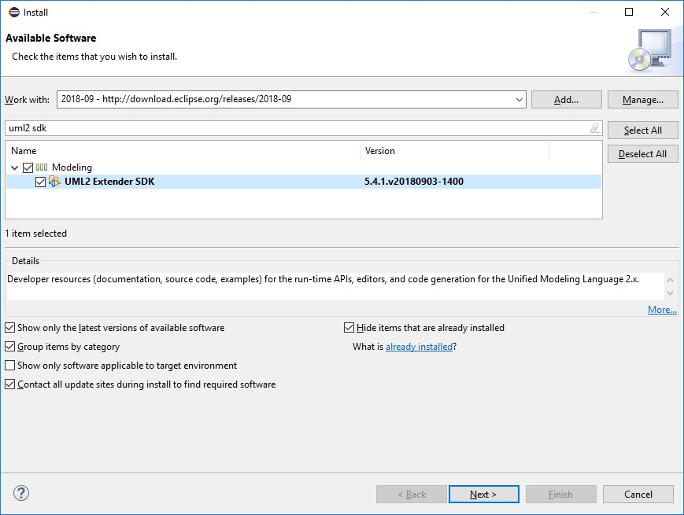
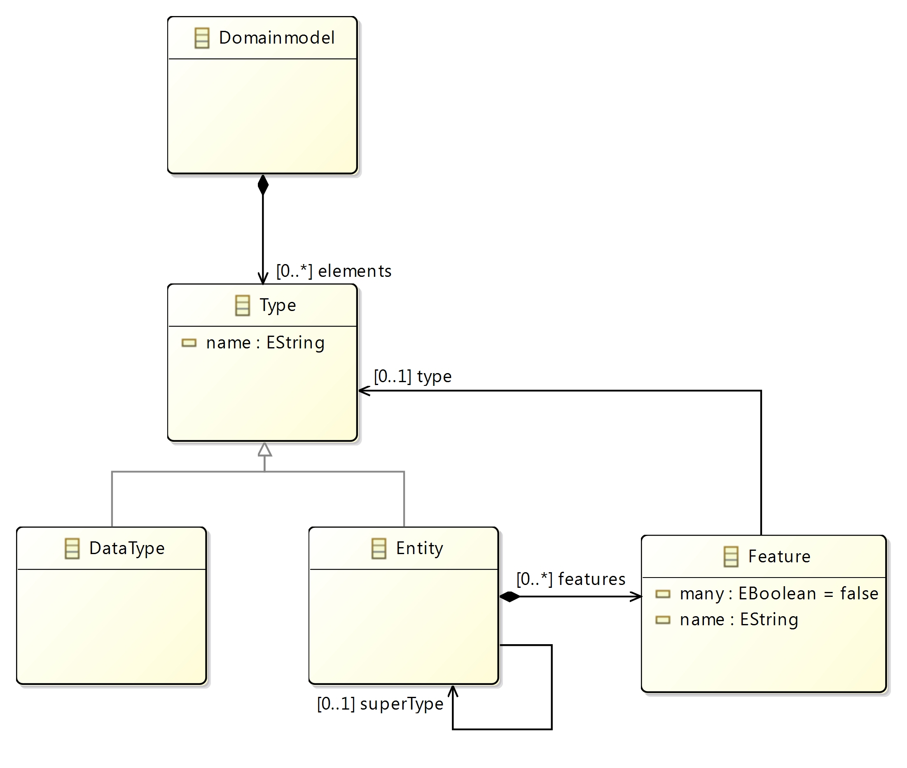
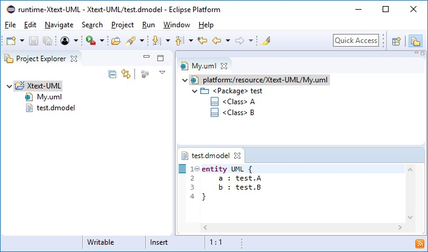

# Referencing UML elements from Xtext DSLs

The previous blog post [Combining EMF Models with Xtext DSLs](https://blogs.itemis.com/en/combining-emf-models-with-xtext-dsls) introduced use cases on combining EMF Models with Xtext DSLs on the model level. This blog post demonstrates the combination of EMF and Xtext on the meta-model level.

#### I. Preparation steps
1. Install the latest version of the `Xtext SDK` the `UML2 Extender SDK` from the Eclipse Release Train.


2. Create the Domainmodel Project based on the [Xtext 15 Minutes Tutorial](https://www.eclipse.org/Xtext/documentation/102_domainmodelwalkthrough.html).

The meta-model of the Domainmodel Project



describes that a domain model consist of certain types (datatypes and entities), an entity contains features and each feature has a type. To be able to use UML classes in the feature's type definition, the following modifications are necessary:

#### II. Modifications in the `org.example.domainmodel` plug-in

3. Extend the [Domainmodel.xtext](https://github.com/itemis/itemis-blog/blob/referencing-uml-elements-from-xtext-dsls/org.example.domainmodel/src/org/example/domainmodel/Domainmodel.xtext#L23) grammar definition

```
grammar org.example.domainmodel.Domainmodel with org.eclipse.xtext.common.Terminals

...

import "http://www.eclipse.org/uml2/5.0.0/UML" as uml

...

Feature:
	(many?='many')? name=ID ':' type=[uml::Class|FQN] | type=[Type];

...
```


4. Extend the [GenerateDomainmodel.mwe2](https://github.com/itemis/itemis-blog/blob/referencing-uml-elements-from-xtext-dsls/org.example.domainmodel/src/org/example/domainmodel/GenerateDomainmodel.mwe2#L11-L66) workflow.

```
module org.example.domainmodel.GenerateDomainmodel

import org.eclipse.emf.mwe.utils.*
import org.eclipse.xtext.xtext.generator.*
import org.eclipse.xtext.xtext.generator.model.project.*

var rootPath = ".."

Workflow {

	bean = StandaloneSetup {
		
		scanClassPath = true
		platformUri = rootPath
		
		uriMap = {
			from = "platform:/plugin/org.eclipse.emf.codegen.ecore/model/GenModel.genmodel"
			to = "platform:/resource/org.eclipse.emf.codegen.ecore/model/GenModel.genmodel"
		}
		uriMap = {
			from = "platform:/plugin/org.eclipse.emf.ecore/model/Ecore.genmodel"
			to = "platform:/resource/org.eclipse.emf.ecore/model/Ecore.genmodel"
		}
		uriMap = {
			from = "platform:/plugin/org.eclipse.uml2.codegen.ecore/model/GenModel.genmodel"
			to = "platform:/resource/org.eclipse.uml2.codegen.ecore/model/GenModel.genmodel"
		}
		uriMap = {
			from = "platform:/plugin/org.eclipse.uml2.uml/model/UML.genmodel"
			to = "platform:/resource/org.eclipse.uml2.uml/model/UML.genmodel"
		}
		uriMap = {
			from = "platform:/plugin/org.eclipse.emf.codegen.ecore/model/GenModel.ecore"
			to = "platform:/resource/org.eclipse.emf.codegen.ecore/model/GenModel.ecore"
		}
		uriMap = {
			from = "platform:/plugin/org.eclipse.emf.ecore/model/Ecore.ecore"
			to = "platform:/resource/org.eclipse.emf.ecore/model/Ecore.ecore"
		}
		uriMap = {
			from = "platform:/plugin/org.eclipse.uml2.codegen.ecore/model/GenModel.ecore"
			to = "platform:/resource/org.eclipse.uml2.codegen.ecore/model/GenModel.ecore"
		}
		uriMap = {
			from = "platform:/plugin/org.eclipse.uml2.uml/model/UML.ecore"
			to = "platform:/resource/org.eclipse.uml2.uml/model/UML.ecore"
		}
		uriMap = {
			from = "platform:/plugin/org.eclipse.uml2.types/model/Types.genmodel"
			to = "platform:/resource/org.eclipse.uml2.types/model/Types.genmodel"
		}
		uriMap = {
			from = "platform:/plugin/org.eclipse.uml2.types/model/Types.ecore"
			to = "platform:/resource/org.eclipse.uml2.types/model/Types.ecore"
		}
		
		registerGeneratedEPackage = "org.eclipse.emf.ecore.EcorePackage"
		registerGeneratedEPackage = "org.eclipse.uml2.uml.UMLPackage"
		registerGeneratedEPackage = "org.eclipse.uml2.types.TypesPackage"
		registerGeneratedEPackage = "org.eclipse.emf.codegen.ecore.genmodel.GenModelPackage"
		registerGeneratedEPackage = "org.eclipse.uml2.codegen.ecore.genmodel.GenModelPackage"
		registerGenModelFile = "platform:/resource/org.eclipse.emf.ecore/model/Ecore.genmodel"
		registerGenModelFile = "platform:/resource/org.eclipse.emf.codegen.ecore/model/GenModel.genmodel"
		registerGenModelFile = "platform:/resource/org.eclipse.uml2.uml/model/UML.genmodel"
		registerGenModelFile = "platform:/resource/org.eclipse.uml2.codegen.ecore/model/GenModel.genmodel"
	}
	
	component = XtextGenerator {
		...
	}
}	
```
5. Add the following plugins to the `Require-Bundle` section in the [MANIFEST.MF](https://github.com/itemis/itemis-blog/blob/referencing-uml-elements-from-xtext-dsls/org.example.domainmodel/META-INF/MANIFEST.MF#L18-L19) file
	* org.eclipse.uml2.uml
	* org.eclipse.uml2.codegen.ecore
	
6. Add the following classes
	* [UMLLanguageConstants.xtend](https://github.com/itemis/itemis-blog/blob/referencing-uml-elements-from-xtext-dsls/org.example.domainmodel/src/org/example/domainmodel/UMLLanguageConstants.xtend)
	* [UMLQualifiedNameProvider.xtend](https://github.com/itemis/itemis-blog/blob/referencing-uml-elements-from-xtext-dsls/org.example.domainmodel/src/org/example/domainmodel/UMLQualifiedNameProvider.xtend)
	* [UMLRuntimeModule.xtend](https://github.com/itemis/itemis-blog/blob/referencing-uml-elements-from-xtext-dsls/org.example.domainmodel/src/org/example/domainmodel/UMLRuntimeModule.xtend)
	* [UMLStandaloneSetup.xtend](https://github.com/itemis/itemis-blog/blob/referencing-uml-elements-from-xtext-dsls/org.example.domainmodel/src/org/example/domainmodel/UMLStandaloneSetup.xtend)
	
#### III. Modifications in the `org.example.domainmodel.ui` plug-in
7. Add the following classes
	* [UMLExecutableExtensionFactory.xtend](https://github.com/itemis/itemis-blog/blob/referencing-uml-elements-from-xtext-dsls/org.example.domainmodel.ui/src/org/example/domainmodel/ui/UMLExecutableExtensionFactory.xtend)
	* [UMLUiModule.xtend](https://github.com/itemis/itemis-blog/blob/referencing-uml-elements-from-xtext-dsls/org.example.domainmodel.ui/src/org/example/domainmodel/ui/UMLUiModule.xtend)
	* [ReflectiveTreeEditorOpener.xtend](https://github.com/itemis/itemis-blog/blob/referencing-uml-elements-from-xtext-dsls/org.example.domainmodel.ui/src/org/example/domainmodel/ui/editor/ReflectiveTreeEditorOpener.xtend)
	* [DomainmodelActivatorEx.xtend](https://github.com/itemis/itemis-blog/blob/referencing-uml-elements-from-xtext-dsls/org.example.domainmodel.ui/src/org/example/domainmodel/ui/internal/DomainmodelActivatorEx.xtend)

8. Register the DomainmodelActivatorEx as the `Bundle-Activator` in the [MANIFEST.MF](https://github.com/itemis/itemis-blog/blob/referencing-uml-elements-from-xtext-dsls/org.example.domainmodel.ui/META-INF/MANIFEST.MF#L27) file.
	
9. Add the following plugin to the `Require-Bundle` section in the [MANIFEST.MF](https://github.com/itemis/itemis-blog/blob/referencing-uml-elements-from-xtext-dsls/org.example.domainmodel.ui/META-INF/MANIFEST.MF#L21)
	* org.eclipse.emf.ecore.editor

10. Add the following section to the [plugin.xml](https://github.com/itemis/itemis-blog/blob/referencing-uml-elements-from-xtext-dsls/org.example.domainmodel.ui/plugin.xml#L435-L442)
```
<!-- register the Xtext UI language services to Xtext's registry -->
<extension
	point="org.eclipse.xtext.extension_resourceServiceProvider">
	<resourceServiceProvider
		class="org.example.domainmodel.ui.UMLExecutableExtensionFactory:org.eclipse.xtext.ui.resource.generic.EmfResourceUIServiceProvider"
		uriExtension="uml">
	</resourceServiceProvider>
</extension>
```

#### IV. Manuel Testing
Start a Runtime Eclipse to verify that the parsing, linking, content assistant, hyperlink navigation, quickfixes, ... functionalities are properly working.


	
#### V. Automated Testing
* Extend the `org.example.domainmodel.tests` plug-in by [Parsing](https://github.com/itemis/itemis-blog/blob/referencing-uml-elements-from-xtext-dsls/org.example.domainmodel.tests/src/org/example/domainmodel/tests/DomainmodelParsingTest.xtend), ... JUnit test cases.
* Extend the `org.example.domainmodel.ui.tests` plug-in by 
 [ContentAssistant](https://github.com/itemis/itemis-blog/blob/referencing-uml-elements-from-xtext-dsls/org.example.domainmodel.ui.tests/src/org/example/domainmodel/ui/tests/DomainmodelContentAssist2Test.xtend), [Highlighting](https://github.com/itemis/itemis-blog/blob/referencing-uml-elements-from-xtext-dsls/org.example.domainmodel.ui.tests/src/org/example/domainmodel/ui/tests/DomainmodelHighlightingTest.xtend),
 [Hovering](https://github.com/itemis/itemis-blog/blob/referencing-uml-elements-from-xtext-dsls/org.example.domainmodel.ui.tests/src/org/example/domainmodel/ui/tests/DomainmodelHover2Test.xtend), [OutlineView](https://github.com/itemis/itemis-blog/blob/referencing-uml-elements-from-xtext-dsls/org.example.domainmodel.ui.tests/src/org/example/domainmodel/ui/tests/DomainmodelOutlineTest.xtend), [Quickfixes](https://github.com/itemis/itemis-blog/blob/referencing-uml-elements-from-xtext-dsls/org.example.domainmodel.ui.tests/src/org/example/domainmodel/ui/tests/DomainmodelQuickfix2Test.xtend), ... JUnit Plug-in test cases.

The entire example is available on the corresponding [GitHub repository](https://github.com/itemis/itemis-blog/tree/referencing-uml-elements-from-xtext-dsls).